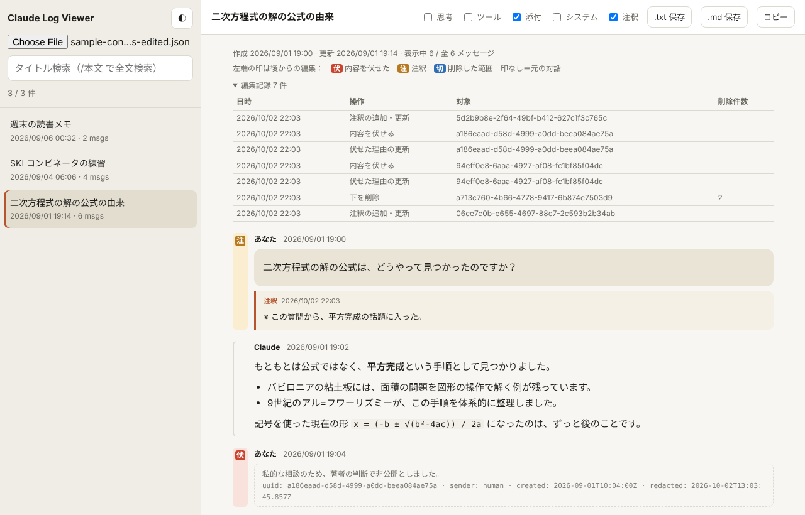
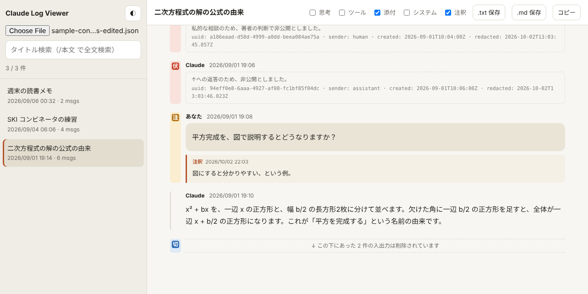
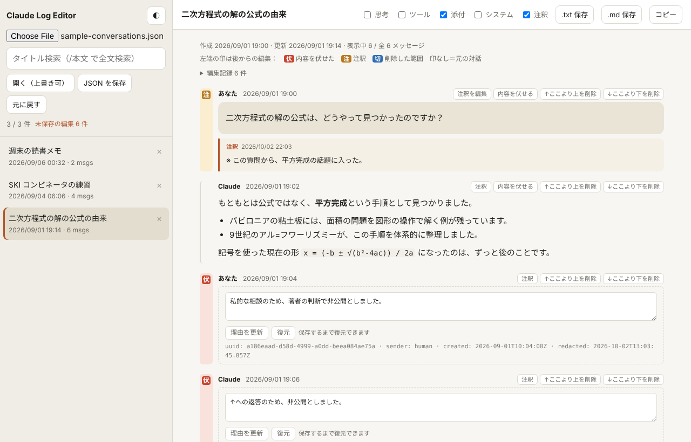

# claude-log-viewer / claude-log-editor

claude.ai からエクスポートした対話ログ（`conversations.json`）を、ブラウザで読み、編集するための HTML ファイルです。どちらも HTML ファイル1枚だけで動きます。



> 画面写真は、架空の会話データ（`sample-conversations.json`）を表示したものです。

---


## 0. 警告
> [!CAUTION]
> - **このソフトウェアは無保証です。このソフトウェアを用いて情報流出などの被害を受けたとしても、保証いたしません。**
> - **この道具が確認しているのは、「受け取った JSON に、どんな編集が申告されているか」までです。** claude.ai のエクスポートには署名がないため、ログが本物であることまでは証明できません。提出に使う場合は、**元の ZIP を手を加えずに保管し、ハッシュ値（例：`sha256sum conversations-000.zip`）を控えておく**ことをおすすめします。
> - **claude.ai から受け取れる JSON の形式は、変更される場合があります。** 形式が変わると、正しく読込・保存・表示・編集できなくなることがあります。


## 1. 目的

### claude-log-viewer.html（ビューア）

エクスポートした対話ログを、claude.ai に近い見た目で読むための道具です。

- 会話の一覧、タイトル検索、本文の全文検索
- 質問を編集したり回答を再生成したりした箇所（分岐）の切り替え
- 思考の要約、ツール呼び出し、添付ファイルの中身の表示・非表示
- 表示中の会話を `.txt` や `.md` で保存、またはクリップボードにコピー
- 編集版で加えた「伏せた発言」「注釈」「削除した範囲」の表示

### claude-log-editor.html（編集版）

対話ログを、他人に見せられる形に整えるための道具です。例えば、論文の査読や学会で「AI の利用記録」を求められたときの提出用です。

- 公開できない発言を**伏せる**（本文を消し、日時などのメタデータと理由だけを残す）
- 発言に後から**注釈**を付ける
- ある発言から**上（または下）をまとめて削除**する
- **会話ごと削除**する（削除したという記録は残る）

どの編集も、編集記録（`edit_log`）として JSON に書き込まれます。また、画面の左端に「伏」「注」「切」の印が付きます。読む人は、どこが元の対話で、どこが後からの編集なのかを、一目で区別できます。



---

## 2. 実行方法

1. `claude-log-viewer.html` または `claude-log-editor.html` を、ブラウザで開きます（ダブルクリック、またはブラウザにドラッグ＆ドロップ）。
2. 左上のファイル選択ボタン（ブラウザにより「ファイルを選択」「Choose File」などと表示）で `conversations.json` を選ぶか、画面に直接ドロップします。

インストール、サーバー、ネット接続は必要ありません。読み込んだデータはブラウザの中だけで処理され、外部には送信されません。

- 推奨ブラウザ：Chrome、Edge、Firefox、Safari の最近の版
- 編集版の「開く（上書き可）」ボタンは、Chrome や Edge など File System Access API に対応したブラウザでだけ表示されます。そのほかのブラウザでは、保存はダウンロードになります。

試しに動かすときは、同梱の `sample-conversations.json`（架空の会話）を読み込んでみてください。`sample-conversations-edited.json` は、それを編集版で編集した後のものです。

---

## 3. claude.ai から対話ログを取り出す方法

### エクスポートを依頼する

エクスポートは、claude.ai のウェブ版、またはデスクトップアプリから行います（iOS・Android アプリからはできません）。

1. 画面左下のイニシャル（アカウントアイコン）をクリック
2. 「設定（Settings）」を選択
3. 「プライバシー（Privacy）」を開く
4. 「データをエクスポート（Export data）」をクリック

しばらくすると、アカウントのメールアドレスにダウンロードリンクが届きます。

- リンクの有効期限は24時間です。切れたら、同じ手順で依頼し直せます。
- ダウンロードには claude.ai へのログインが必要です。
- この手順は個人アカウント（Free・Pro・Max）向けです。Team や Enterprise では、組織の管理者がエクスポートを行います。

参考：[How can I export my Claude data? | Claude Help Center](https://support.claude.com/en/articles/9450526-how-can-i-export-my-claude-data)

### conversations.json を見つける

届いた ZIP を展開すると、例えば次のような構成になっています（2026年9月時点の例です。形式は変わることがあります）。

```
conversations-000.zip
conversations-000/
  conversations.json        ← これを読み込む
frames-000/                 （会話中に作ったアーティファクト）
projects-000/               （プロジェクト）
light_metadata-000/
  users.json                （アカウント情報）
  login_history.json        （ログイン履歴）
```

ディレクトリ名やファイル名が違う場合は、展開したフォルダで次のコマンドを実行すると見つかります。

```bash
find . -name 'conversations*.json'
```

注意点：

- `conversations.json` をテキストエディタで開くと、日本語が `数学…` のように見えますが、壊れてはいません。JSON の文字エスケープなので、このツールで読み込めば正しく表示されます。
- `users.json` や `login_history.json` には、メールアドレスやログイン履歴などの個人情報が入っています。対話ログを他人に渡すときは、これらを一緒に渡さないでください。
- 会話に貼った画像の本体は、エクスポートに含まれません（ファイル名だけが残ります）。

---

## 4. 操作方法

### ビューアと編集版に共通の操作

| 操作 | 場所 | 説明 |
|---|---|---|
| ファイルを開く | 左上のファイル選択ボタン、または画面へのドロップ | `conversations.json` を読み込む |
| タイトル検索 | 左上の検索欄 | 入力した文字を含むタイトルの会話に絞り込む |
| 全文検索 | 検索欄の先頭に `/` を付ける（例：`/平方完成`） | 本文も含めて検索する |
| 会話を開く | 左の一覧をクリック | 右側に会話を表示する |
| 分岐の切り替え | 発言の横の「‹ 分岐 2/3 ›」 | 編集・再生成された別の版を表示する（初期表示は最新の版） |
| 表示の切り替え | 上部の「思考」「ツール」「添付」「システム」「注釈」 | 各要素の表示・非表示。保存・コピーの内容にも反映される |
| テキストで保存 | 上部の「.txt 保存」「.md 保存」 | 表示中の会話（表示中の分岐）をファイルに保存する |
| コピー | 上部の「コピー」 | 表示中の会話をクリップボードにコピーする |
| 編集記録を見る | 会話の冒頭の「編集記録 N 件」 | いつ、どの発言に、どんな編集をしたかの一覧を開く |
| テーマ切替 | 左上の「◐」 | 明るい表示と暗い表示を切り替える |

### 左端の印

| 印 | 意味 |
|---|---|
| 伏（赤） | 内容を伏せた発言。本文の代わりに、伏せた理由とメタデータを表示する |
| 注（黄） | 注釈が付いた発言。注釈は本文の下に表示する |
| 切（青） | 削除した範囲。「↑ この上にあった N 件…」「↓ この下にあった N 件…」の行に付く |
| 印なし | 手を加えていない、元の対話 |

### 編集版だけの操作



| 操作 | 場所 | 説明 |
|---|---|---|
| 会話の削除 | 一覧の各会話の「×」 | 本文とタイトルを消し、uuid・日時・件数と削除の記録だけを残す。削除済みの会話でもう一度「×」を押すと、記録ごと完全に消える |
| 注釈 | 各発言の右上の「注釈」 | 入力欄が開く。Markdown が使える。「注釈を保存」で確定、「注釈を削除」で削除 |
| 内容を伏せる | 各発言の右上の「内容を伏せる」 | 本文・添付・ツール記録を消し、メタデータだけを残す |
| 伏せた理由の編集 | 伏せた発言の入力欄と「理由を更新」 | 表示される理由を書き換える。複数行も可 |
| 復元 | 伏せた発言の「復元」 | 伏せる前の内容に戻す。「JSON を保存」するまでのみ可能 |
| ↑ここより上を削除 | 各発言の右上 | その発言を含めて、それより前をすべて削除する。次の発言が会話の先頭になる |
| ↓ここより下を削除 | 各発言の右上 | その発言を含めて、それより後をすべて削除する（他の分岐も含む） |
| 元に戻す | 左上の「元に戻す」 | 直前の編集を取り消す。保存するまで何段階でも可能 |
| JSON を保存 | 左上の「JSON を保存」 | 編集後の JSON を `元の名前-edited.json` としてダウンロードする |
| 開く（上書き可） | 左上（Chrome・Edge のみ） | このボタンで開いたファイルは、保存時に元のファイルへ上書きできる |

### JSON に追加される欄

編集版は、元の JSON の形を保ったまま、次の欄を追加します。

| 欄 | 付く場所 | 内容 |
|---|---|---|
| `redacted`, `redaction_note`, `redacted_at` | 発言 | 伏せたこと、伏せた理由、伏せた日時 |
| `annotation`, `annotation_updated_at` | 発言 | 注釈の本文と更新日時 |
| `cut_above_count`, `cut_below_count` | 発言 | その位置の上（下）で削除した発言の件数（編集を重ねると積算される） |
| `edit_log` | 会話 | 編集記録（日時、操作、対象の発言、削除件数、削除した発言の uuid） |
| `deleted`, `deleted_message_count` | 会話 | 会話を削除したこと、元のメッセージ数 |

### 注意点

- 「復元」用の元の内容は、ブラウザのメモリにだけ保持されます。保存前にタブを閉じたり再読み込みしたりすると、復元できなくなります。
- 伏せた理由の初期値は「この入力・出力は審査の段階で不適切だと判定されたので除去しております」です。実際の経緯に合わせて書き換えてください。初期値そのものを変えたい場合は、HTML ファイルの中の `REDACT_NOTE` という定数を書き換えてください（ビューアと編集版の両方にあります）。
- Markdown の表示は簡易的なものです。複雑な記法は崩れることがあります。

---

## 5. このプロジェクトについて

このツールは、筆者が自分の AI 利用記録を整理するために、Claude と対話しながら作ったものです。

**筆者は今後、このプロジェクトの保守や機能追加、問い合わせへの対応を行う予定はありません。** 不具合の修正、機能の追加、仕様の策定、他の AI サービスへの対応、アプリ化など、どうぞご自由に行ってください。フォーク、改変、再配布、商用利用も、下記の MIT License の範囲で自由です。仕様書はありませんが、それぞれ HTML ファイル1枚なので、ソースコードを読めば分かるはずです。

---

## 6. ライセンス

MIT License

Copyright (c) 2026 <著作権者名>

Permission is hereby granted, free of charge, to any person obtaining a copy
of this software and associated documentation files (the "Software"), to deal
in the Software without restriction, including without limitation the rights
to use, copy, modify, merge, publish, distribute, sublicense, and/or sell
copies of the Software, and to permit persons to whom the Software is
furnished to do so, subject to the following conditions:

The above copyright notice and this permission notice shall be included in all
copies or substantial portions of the Software.

THE SOFTWARE IS PROVIDED "AS IS", WITHOUT WARRANTY OF ANY KIND, EXPRESS OR
IMPLIED, INCLUDING BUT NOT LIMITED TO THE WARRANTIES OF MERCHANTABILITY,
FITNESS FOR A PARTICULAR PURPOSE AND NONINFRINGEMENT. IN NO EVENT SHALL THE
AUTHORS OR COPYRIGHT HOLDERS BE LIABLE FOR ANY CLAIM, DAMAGES OR OTHER
LIABILITY, WHETHER IN AN ACTION OF CONTRACT, TORT OR OTHERWISE, ARISING FROM,
OUT OF OR IN CONNECTION WITH THE SOFTWARE OR THE USE OR OTHER DEALINGS IN THE
SOFTWARE.
